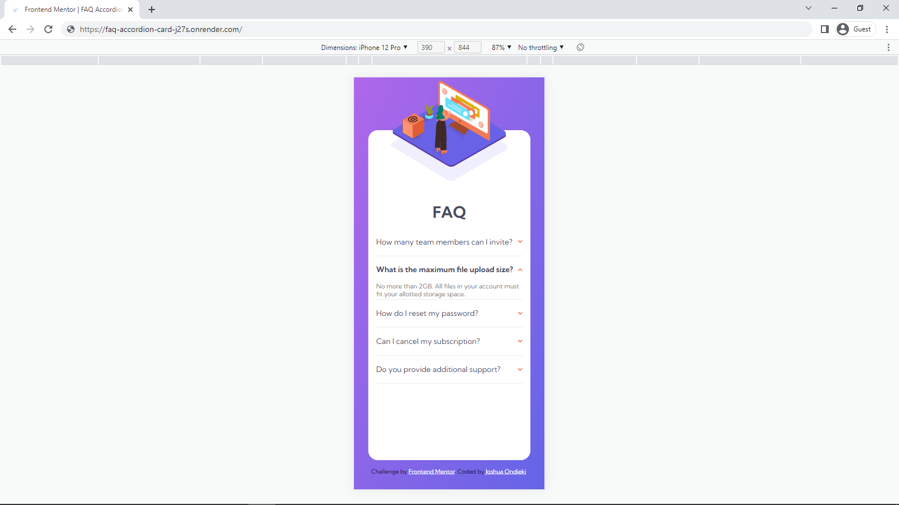

# THE-Jitu
Tasks completed at THE Jitu Software Developer Training

# FAQ Accordion Card

**CHALLENGE:** [Frontend Mentor | FAQ Accordion Card](https://www.frontendmentor.io/challenges/faq-accordion-card-XlyjD0Oam)

**MY SOLUTION:** [FAQ ACCORDION CARD HOSTED ON RENDER](https://faq-accordion-card-j27s.onrender.com/)

| DESKTOP | MOBILE |
| -- | -- |
|  |  |
